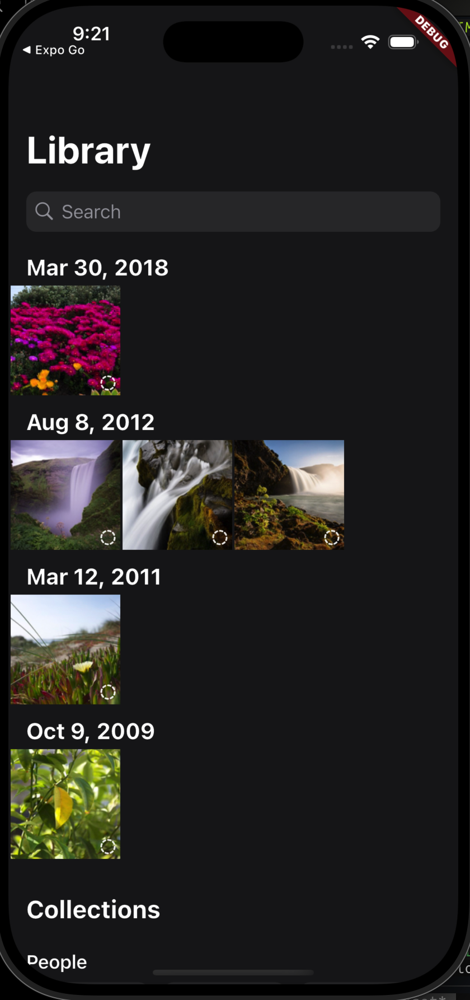
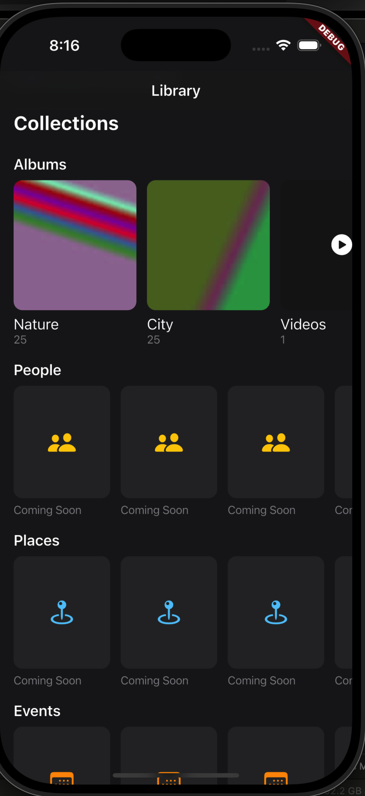
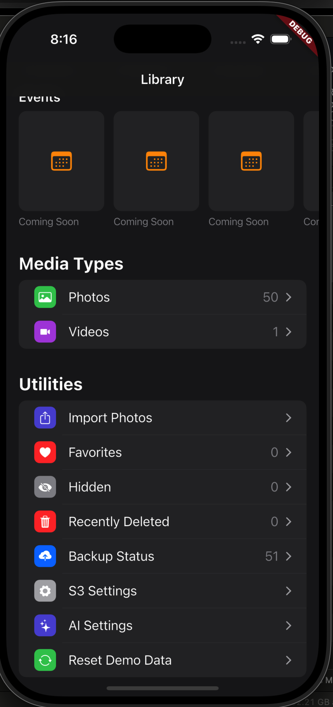

# Bring Your Own Photos

Flutter app (iOS first, Android backlog) that backs up Photos/Videos to your own S3 bucket, with thumbnail-first browsing and storage tiering via your bucket's own Lifecycle Rules. Localized (English, Mandarin) from the start.

Design: `docs/design/DESIGN.md`
UI/UX: `docs/design/UIUX_DESIGN_GUIDELINE.md`
Plan: `docs/design/IMPLEMENTATION_PLAN.md`

## Setup

```
./scripts/bootstrap-flutter.sh   # clones Flutter SDK locally into .tools/, no system install
.tools/flutter/bin/flutter run
```

Or, if you already have Flutter installed system-wide: `flutter run`.

## Screenshots

**Photo Library**


**Collections**


**Media Types & Utilities**

